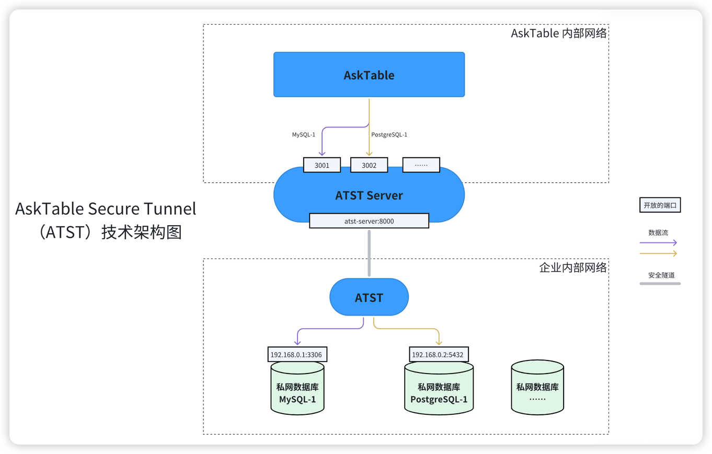

# AskTable Secure Tunnel (ATST) 用户使用手册

## 1. 概述
AskTable Secure Tunnel (ATST) 是 [AskTable](https://asktable.com) 团队开发的一个安全工具，允许 AskTable 服务通过安全隧道与内部的本地数据库进行通信。这项服务确保数据源与 AskTable 之间的连接既安全又高效，非常适合需要保证数据通信安全性的企业环境。详见：[Github](https://github.com/DataMini/asktable-secure-tunnel)

您可以参考本文档，在您的私有网络中部署并运行 ATST。




## 2. 开始使用 ATST

部署 ATST 非常简单，首先请按照如下要求准备一台服务器，然后执行一个Docker命令即可。

服务器要求：
1. 网络方面：确保这台服务器可以访问 AskTable(https://api.asktable.com/) 和您的数据库。
2. 操作系统：Linux 或 macOS（M1/M2 ARM）
3. 处理器架构：x86 或 ARM
4. 运行环境：请确保您的服务器上已经安装了 Docker。
5. 服务器配置：不低于 2核 4G内存（不需要磁盘）


### 2.1 下载 ATST 镜像

您可以通过以下命令下载 ATST Docker 镜像

```bash
docker pull datamini/asktable-secure-tunnel
```

### 2.2 使用方法

启动 ATST 服务前，您需要一个唯一的 `Secure Tunnel ID(securetunnel_id)`来标识和启动您的 ATST：

1. 创建 `securetunnel_id`：
   其中 `<asktable_token>` 是AskTable分配给您的Token，可联系 `contact@datamini.ai` 获取。
    ```bash
    docker run --rm -e ASKTABLE_TOKEN=<asktable_token> datamini/asktable-secure-tunnel create-id
    ```
  此命令将返回一个 `securetunnel_id`，请妥善保存此 ID，因为它是您当前 ATST 的唯一标识。
  

2. 启动 ATST 服务：
    ```bash
    docker run -d -P -e ASKTABLE_TOKEN=<asktable_token> -e SECURETUNNEL_ID=<securetunnel_id> datamini/asktable-secure-tunnel
    ```
说明：
 - 参数 `-e SECURETUNNEL_ID=<securetunnel_id>` 可选：用于指定当前 ATST 的 ID。若未指定，则自动创建一个，但不建议这样，因为一旦重启，可能会影响数据通信。
 - 端口 `1260`：ATST 内置了一个Web监控页面，以1260端口运行，您可以在 `Docker` 运行时添加 `-P` 或 `-p` 参数将端口暴露出来，以便于通过浏览器访问该监控页面。

启动后，ATST 将自动从 AskTable 获取配置信息并开始运行，同时定期自动更新。一个 ATST 可以共享给多个数据源使用。

### 2.3 环境变量配置

- ASKTABLE_API_URL： AskTable 服务的 API 地址，默认为 `https://api.asktable.com`，无需更改。
- ASKTABLE_TOKEN： AskTable 服务的 API Token，从[AskTable网站](https://asktable.com)获取。
- SECURETUNNEL_ID： ATST 的唯一标识。


## 3. 注册数据源

要让 AskTable 通过 ATST 访问您的内部数据源，您需要注册数据源并指定 `securetunnel_id`：

```python
from asktable import AskTable
at = AskTable()
at.datasources.register(
    type='mysql', 
    access_config={
        'host': '10.1.2.3', 'port': 3306, 'user': 'xx', 'password': 'xx', 
        'securetunnel_id': 'xxx'
    }
)
```
在 access_config 配置信息中增加 `securetunnel_id` 字段，将其设置为您的 `securetunnel_id`，从而使 AskTable 能够通过 ATST 访问您的数据源。更多信息请参考：[AskTable Python Library](https://pypi.org/project/asktable/).

## 4. 维护和管理 ATST 服务【非常重要】

请不要随意关闭 ATST 服务，否则 AskTable 将无法访问您的数据源。

如果需要重启、升级或迁移 ATST 服务，请确保`securetunnel_id`不变，以保证数据源的正常访问。

为了保证`securetunnel_id`的安全性，我们建议您在启动 ATST 服务时使用环境变量来传递`securetunnel_id`，而不是让 ATST 自动生成。


## 5. 高级功能
您可以通过Python SDK 或命令行工具 `asktable` 来获取 ATST 信息。详见：https://pypi.org/project/asktable/


## 6. 安全和隐私
保持您的 `asktable_token`和`securetunnel_id` 安全是极其重要的。不要在不安全的地方存储或共享这些信息，以避免未授权访问您的数据源。

## 7. 故障排除
若 ATST 服务遇到任何问题，首先请检查 `asktable_token`和`securetunnel_id` 是否正确无误，确保您的网络环境允许 ATST 正常访问您的数据库以及 AskTable。

您也可以使用浏览器打开内置的监控页面查看更多信息和配置。

如有更多技术问题，请联系 AskTable 技术支持。

## 8. FAQ

### 8.1 是否可以同时运行多个 ATST 服务？
是的，您可以同时运行多个 ATST 服务，每个服务使用不同的 `securetunnel_id`。

如果使用相同的 `securetunnel_id` 启动，则会报错如下：

```
start error: proxy [[proxies]] already exists
```

# 感谢
AskTable Secure Tunnel 使用了 [frp](https://github.com/fatedier/frp)，一个高性能的反向代理服务。感谢 frp 项目组的贡献。

