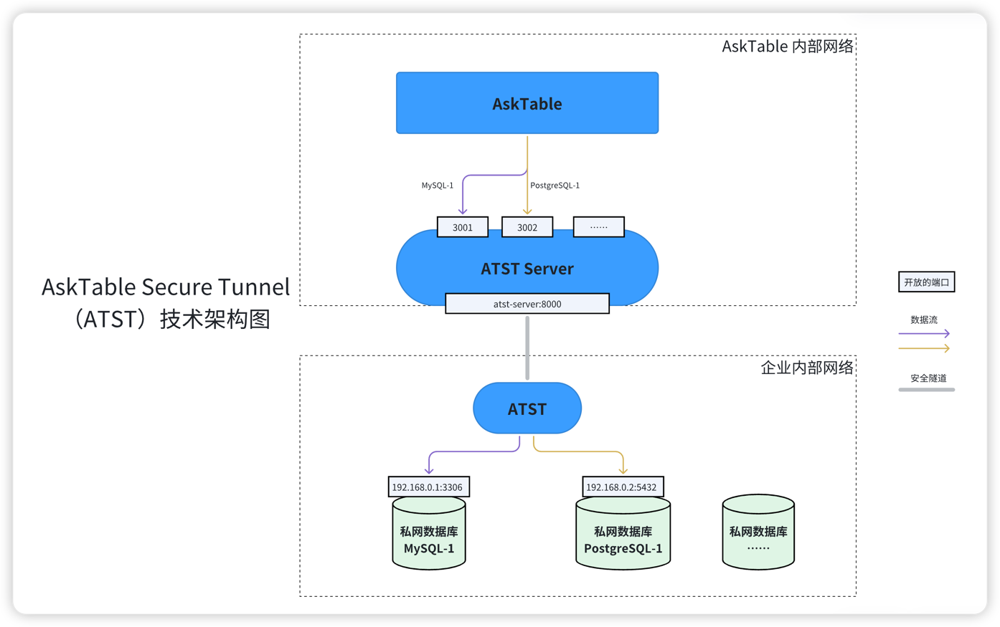

# AskTable Secure Tunnel (ATST) 用户使用手册

## 1. 概述
AskTable Secure Tunnel (ATST) 是 [AskTable](https://asktable.com) 团队开发的一个安全工具，允许 AskTable 服务通过安全隧道与内部的本地数据库进行通信。这项服务确保数据源与 AskTable 之间的连接既安全又高效，非常适合需要保证数据通信安全性的企业环境。详见：[Github](https://github.com/DataMini/asktable-secure-tunnel)

您可以参考本文档，在您的私有网络中部署并运行 ATST。




## 2. 开始使用 ATST

部署 ATST 非常简单，首先请按照如下要求准备一台服务器，然后执行一个Docker命令即可。

服务器要求：
1. 网络方面：确保这台服务器可以访问 AskTable(https://api.asktable.com/) 和您的数据库。
2. 操作系统：Linux 或 macOS（M1/M2 ARM）
3. 处理器架构：x86 或 ARM
4. 运行环境：请确保您的服务器上已经安装了 Docker。
5. 服务器配置：不低于 2核 4G内存（不需要磁盘）


### 2.1 获取 ATST_ID

在[[AskTable 应用](https://cloud.asktable.com/)中创建或选择安全隧道，使用它的ID（以`atst_`打头）。


### 2.2 下载 ATST 镜像

您可以通过以下命令下载 ATST Docker 镜像

```bash
docker pull datamini/asktable-secure-tunnel
```

### 2.3 启动 ATST 容器

```bash
docker run -d -P -e API_KEY=<API_KEY> -e ATST_ID=<ATST_ID> datamini/asktable-secure-tunnel
```

说明：
 - 参数 `-e API_KEY=<API_KEY>`：AskTable 服务的 API API_KEY，在[AskTable 应用](https://cloud.asktable.com/)中获取。
 - 参数 `-e ATST_ID=<ATST_ID>` 该容器对应的安全隧道的 ID，

启动后，ATST 将自动从 AskTable 获取配置信息并开始运行，同时定期自动更新。一个 ATST 可以共享给多个数据源使用。


### 2.4 添加数据源的时候绑定 ATST

要让 AskTable 通过 ATST 访问您的内部数据源，您需要在添加数据源的时候绑定 `ATST_ID`。


如果使用 Python SDK 注册数据源，请在创建DataSource的时候，在access_config中增加`securetunnel_id`字段，并设置为您的`ATST_ID`。

请参考 [AskTable Python SDK](https://github.com/DataMini/asktable-python/blob/main/api.md#datasources) 文档。


## 3. 维护和管理 ATST 服务【非常重要】

3.1 监控页面 
  ATST 内置了一个Web监控页面，以`1260`端口运行，您可以在 `Docker` 运行时添加 `-P` 或 `-p` 参数将端口暴露出来，以便于通过浏览器访问该监控页面。

3.2 重启、升级或迁移
请不要随意关闭 ATST 服务，否则 AskTable 将无法访问您的数据源。

如果需要重启、升级或迁移 ATST 服务，请确保`ATST_ID`不变，以保证数据源的正常访问。

为了保证`ATST_ID`的安全性，我们建议您在启动 ATST 服务时使用环境变量来传递`ATST_ID`，而不是让 ATST 自动生成。


## 4. 高级功能
您可以通过登录 [AskTable 官网](https://cloud.asktable.com/) 或使用 [AskTable Python SDK](https://pypi.org/project/asktable/) 来查看安全隧道的状态。


## 5. 安全和隐私
保持您的 `API_KEY`和`ATST_ID` 安全是极其重要的。不要在不安全的地方存储或共享这些信息，以避免未授权访问您的数据源。

## 6. 故障排除
若 ATST 服务遇到任何问题，首先请检查 `API_KEY`和`ATST_ID` 是否正确无误，确保您的网络环境允许 ATST 正常访问您的数据库以及 AskTable。

您也可以使用浏览器打开内置的监控页面查看更多信息和配置。

如有更多技术问题，请联系 AskTable 技术支持。

## 7. FAQ

### 7.1 是否可以同时运行多个 ATST 服务？
是的，您可以同时运行多个 ATST 服务，每个服务使用不同的 `ATST_ID`。

如果使用相同的 `ATST_ID` 启动，则会报错如下：

```
start error: proxy [[proxies]] already exists
```

# 感谢
AskTable Secure Tunnel 使用了 [frp](https://github.com/fatedier/frp)，一个高性能的反向代理服务。感谢 frp 项目组的贡献。

